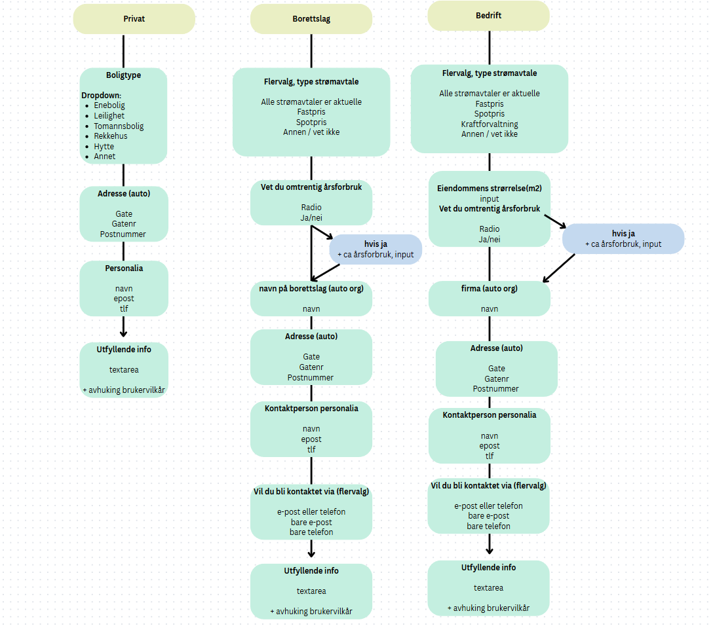

# Skjemahåndtering konfigurert i JSON

Dette prosjektet er et dynamisk skjemaoppsett basert på strøm.no. Skjemaene er konfigurert via JSON og rendres dynamisk i React.

Ved endring, fjerning eller opprettelse av nye skjemafelter, trenger kun JSON-filen å endres - frontend fikser visningen dynamisk.

## Struktur

Jeg startet med å lage et svært enkelt flytskjema for å få oversikt over skjemastruktur og felter som trengs for de ulike brukertypene, som en cheat-sheet under JSON-oppbygging.

**Flytskjema:**



---

## Oppbygging

### JSON-skjemaer

Hver brukertype har sitt eget skjema definert i en JSON-fil:

- `privat-skjema.json`
- `borettslag-skjema.json`
- `bedrift-skjema.json`

Disse beskriver stegene og feltene som skjemaene består av.

Eksempel fra `borettslag-skjema.json`:

```json
"id": "utfyllende_info",
            "type": "textarea",
            "label": "Utfyllende informasjon",
            "required": false,
            "placeholder": "Skriv eventuelle spørsmål eller kommentarer her!",
            "fields": [
                {
                    "id": "brukervilkar",
                    "type": "checkbox",
                    "label": "Jeg godtar brukervilkårene.",
                    "required": true
                }
            ]
```

### Komponentstruktur

- **App**: Benytter state og knapper for å sendre riktig JSON-fil til SkjemaWiz som prop.
- **SkjemaWiz**: Hovedkomponenten som styrer flyt og rendring av skjemaet. Benytter state for å holde kontroll på stegene, og en switch-funksjon for å rendre korrekt felt-komponent.
- **Felt-komponenter**: Gjenbrukbare komponenter for hver felttype (`TextField`, `DropdownField`, `CheckboxField`, `CheckboxesField`, `RadioButtonField`, `TextareaField`).
- **Dynamisk rendering**: Skjemaet bygges opp steg for steg basert på JSON-konfigurasjonen.

## Ikke hensyntatte aspekter:

Dette lille prosjektet er kun laget for å lære mer om hvordan JSON kan benyttes til å konfigurere dynamiske skjemaer. Det er ikke implementert errorhåndtering, inputvalidering eller lagring av data, objektene skrives kun til konsoll ved fullføring av skjemaet. Tilbakemeldinger på brukerfeil eller andre UX-aspekter er heller ikke hensyntatt.

## For å kjøre:

1. Installer dependencies:
   ```bash
   npm install
   ```
2. Start Vite-server:
   ```bash
   npm run dev
   ```

---
